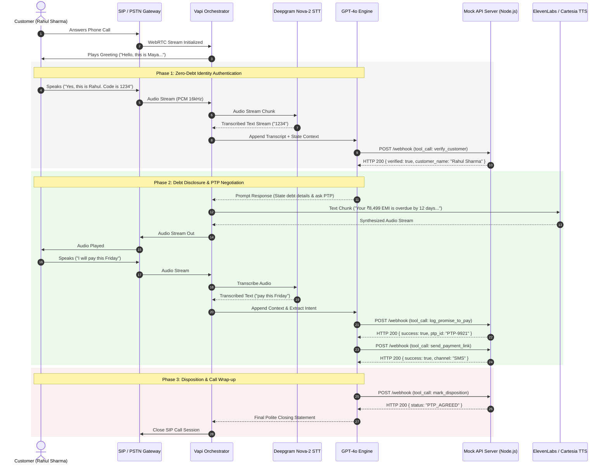
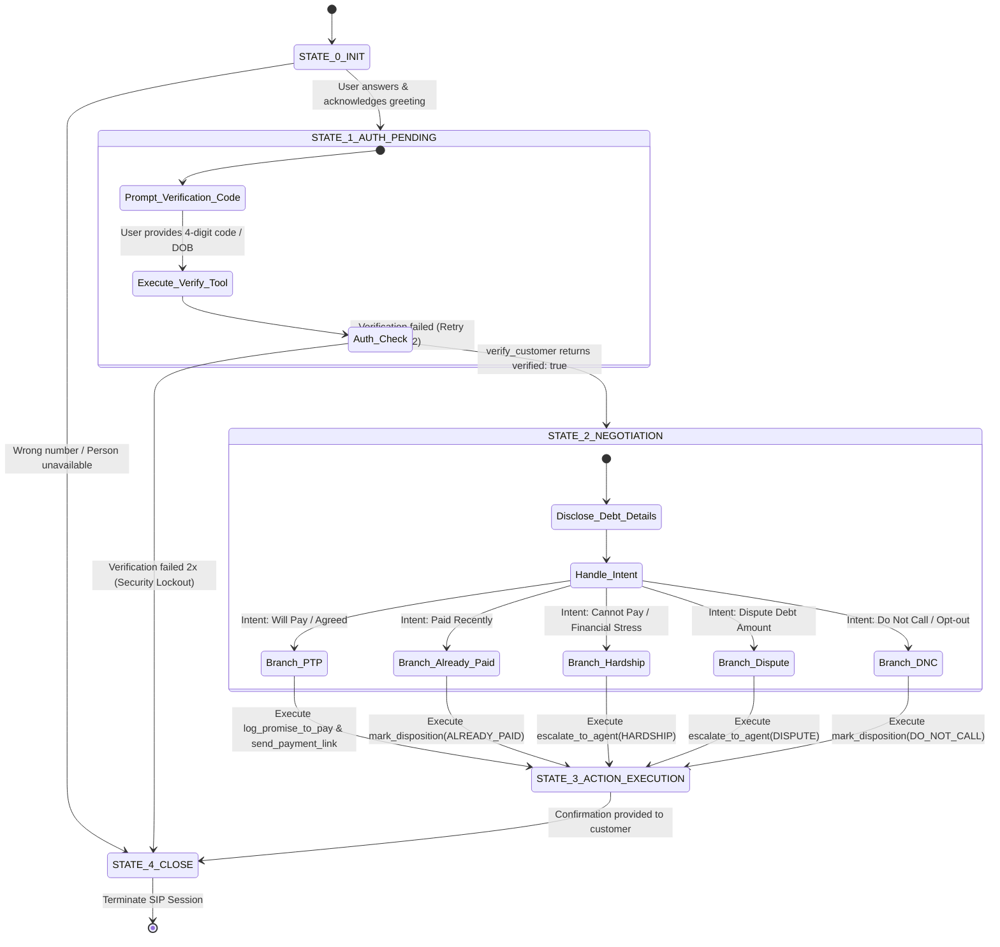

# High-Level Design (HLD) Document: Kapture Finance Voice AI Collections Agent ("Maya")

**Author:** AI Delivery Engineering Team  
**Client:** Kapture Finance  
**System Name:** Outbound Voice AI Collections Agent ("Maya")  
**Version:** 1.0.0  
**Target Latency:** $< 1.2\text{ seconds}$ total round-trip  

---

## 1. System Pipeline & Latency Budget

### 1.1 Architectural Overview
The Voice AI Collections Agent operates as a real-time, bidirectional streaming pipeline. Voice audio streams over PSTN/SIP into Vapi.ai, which orchestrates Speech-to-Text (STT), Large Language Model (LLM) decision making, tool calls via HTTPS Webhooks, and Text-to-Speech (TTS) audio synthesis back to the customer.



### 1.2 Latency Budget Breakdown
To maintain a natural human conversation flow, the end-to-end round-trip latency must not exceed $1200\text{ ms}$ ($1.2\text{ s}$).

| Pipeline Component | Service / Technology | Expected Latency | Optimization Strategy |
| :--- | :--- | :--- | :--- |
| **Telephony Transport** | WebRTC / SIP Trunk (Twilio/Vapi) | $\sim 150\text{ ms}$ | Direct SIP routing, jitter buffer tuning |
| **Speech-to-Text (STT)** | Deepgram Nova-2 (Telephony model) | $\sim 180\text{ ms}$ | Endpointing set to $400\text{ms}$, interim results enabled |
| **Orchestrator Overhead**| Vapi Engine | $\sim 80\text{ ms}$ | Concurrent processing, zero extra network hops |
| **LLM Inference** | OpenAI `gpt-4o` / `gpt-4o-mini` | $\sim 350\text{ ms}$ | Low temperature ($0.1$), stream first token output |
| **Tool Execution** | Node.js Express Webhook (Local/Cloud) | $\sim 120\text{ ms}$ | Asynchronous logging, lightweight API payloads |
| **Text-to-Speech (TTS)**| Cartesia Sonic / ElevenLabs Turbo | $\sim 220\text{ ms}$ | WebSocket audio streaming, chunked synthesis |
| **Network Buffer** | Buffer margin | $\sim 100\text{ ms}$ | CDN edge placement, TCP warm socket connection |
| **Total Target Latency**| **End-to-End Voice Round-Trip** | **$1200\text{ ms}$ ($1.2\text{s}$)** | **Sub-second perceptual response threshold** |

---

## 2. Conversation Flow & State Machine

The voice agent logic is governed by a **Deterministic State Machine**. Transitions out of unauthenticated states are hard-locked by tool execution responses rather than discretionary LLM prompts.



### State Lock Rules:
1. **Unauthenticated Lock (`STATE_0` & `STATE_1`)**: The agent is strictly prohibited from uttering words such as *"overdue"*, *"loan"*, *"EMI"*, *"amount"*, or *"Kapture Finance debt"*.
2. **Hard State Lock Transition**: `STATE_1_AUTH_PENDING` $\rightarrow$ `STATE_2_NEGOTIATION` can ONLY occur when `verify_customer` tool call returns `{ "verified": true }`.
3. **Opt-Out Preemption**: A customer request to "Stop calling me" or "Remove my number" in ANY state immediately forces execution of `mark_disposition(status: "DO_NOT_CALL")` and transitions to `STATE_4_CLOSE`.

---

## 3. Intents & Entities Specification

| Intent Category | Triggers / Example Utterances | Extracted Entities | Target State | Target Action |
| :--- | :--- | :--- | :--- | :--- |
| `Confirm_Identity` | "Yes, this is Rahul", "Speaking", "Rahul here" | `Customer_Name` | `STATE_1` | Prompt verification code |
| `Provide_Auth_Code` | "1234", "My PAN last digits are 1234", "1995" | `Verification_Code` | `STATE_1` | Trigger `verify_customer` tool |
| `Promise_To_Pay` | "I will pay by Friday", "I can pay on 15th August" | `PTP_Date` (ISO-8601), `PTP_Amount` | `STATE_3` | Trigger `log_promise_to_pay` & `send_payment_link` |
| `Already_Paid` | "I paid yesterday via Google Pay", "Payment completed" | `Payment_Mode`, `Payment_Date` | `STATE_3` | Trigger `mark_disposition(ALREADY_PAID)` |
| `Hardship_Claim` | "I lost my job", "Medical emergency", "No money" | `Hardship_Reason` | `STATE_3` | Trigger `escalate_to_agent(HARDSHIP_REQUEST)` |
| `Dispute_Debt` | "This amount is wrong", "I canceled this loan" | `Dispute_Reason` | `STATE_3` | Trigger `escalate_to_agent(DISPUTE)` |
| `Request_DNC` | "Don't call me again", "Remove from database" | `Opt_Out_Flag` | `STATE_3` | Trigger `mark_disposition(DO_NOT_CALL)` |
| `Wrong_Person` | "Wrong number", "No Rahul lives here" | `Available_Flag` | `STATE_4` | Trigger `mark_disposition(WRONG_PERSON)` |

---

## 4. API & Tool Definitions (Webhook Schema)

The backend provides five standardized HTTPS POST webhook endpoints for Vapi function execution:

### 4.1 `get_account_details`
- **Purpose:** Fetches customer loan metadata, current overdue balance, DPD (days past due), and authorized verification codes.
- **Request Payload:**
```json
{
  "phone": "+916303551518"
}
```
- **Response Payload:**
```json
{
  "account_id": "ACC-88392",
  "customer_name": "Rahul Sharma",
  "loan_type": "Personal Loan",
  "overdue_amount": 8499,
  "dpd": 12,
  "valid_codes": ["1234", "1995"]
}
```

### 4.2 `verify_customer`
- **Purpose:** Verifies customer identity using last 4 digits of PAN or birth year.
- **Request Payload:**
```json
{
  "account_id": "ACC-88392",
  "verification_code": "1234"
}
```
- **Response Payload:**
```json
{
  "verified": true,
  "customer_name": "Rahul Sharma",
  "message": "Identity verified successfully."
}
```

### 4.2 `log_promise_to_pay`
- **Purpose:** Logs agreed payment date and commitment amount.
- **Request Payload:**
```json
{
  "account_id": "ACC-88392",
  "ptp_date": "2026-08-14",
  "amount": 8499
}
```
- **Response Payload:**
```json
{
  "success": true,
  "ptp_id": "PTP-9921",
  "confirmed_date": "2026-08-14",
  "amount": 8499
}
```

### 4.3 `send_payment_link`
- **Purpose:** Dispatches payment URL via SMS or WhatsApp.
- **Request Payload:**
```json
{
  "account_id": "ACC-88392",
  "channel": "SMS"
}
```
- **Response Payload:**
```json
{
  "success": true,
  "message": "Payment link sent via SMS to registered mobile number."
}
```

### 4.4 `mark_disposition`
- **Purpose:** Finalizes call outcome in the CRM database.
- **Request Payload:**
```json
{
  "account_id": "ACC-88392",
  "status": "PTP_AGREED",
  "notes": "Customer committed to pay ₹8499 on 2026-08-14"
}
```
- **Response Payload:**
```json
{
  "success": true,
  "disposition_logged": "PTP_AGREED",
  "timestamp": "2026-08-12T11:30:00Z"
}
```

### 4.5 `escalate_to_agent`
- **Purpose:** Transfers call to human collections manager or grievance desk.
- **Request Payload:**
```json
{
  "account_id": "ACC-88392",
  "reason": "HARDSHIP_REQUEST"
}
```
- **Response Payload:**
```json
{
  "success": true,
  "transfer_number": "+9118005550199",
  "status": "INITIATING_TRANSFER"
}
```

---

## 5. Auth & Data Safety Protocols

1. **Third-Party Non-Disclosure (Strict Enforcement)**:
   If a spouse, family member, or colleague answers the call, the bot MUST NOT state that the call is regarding an overdue EMI, loan default, or Kapture Finance debt.
2. **PII Masking & Privacy Rules**:
   - Log files must automatically sanitize PII data before persisting (e.g., `Rahul S****`, `PAN: ****1234`).
   - Payment links sent via SMS use single-use tokenized URLs (`https://kapture.fin/p/tk_88392a9`).
3. **Authentication Verification Threshold**:
   - 2 verification attempts permitted per call session.
   - If both attempts fail, the agent logs `AUTH_FAILED` disposition and terminates gracefully without disclosing debt information.

---

## 6. Compliance & Guardrails (RBI Fair Practice Code)

1. **Permitted Calling Hours**:
   - Calling restricted strictly between **08:00 AM and 07:00 PM local time**. Calls attempted outside this window are automatically rejected by the scheduler.
2. **Zero Threat / Zero Harassment Policy**:
   - Tone is strictly calm, empathetic, and professional.
   - Absolute prohibition against threatening legal action, police reports, or using abusive tone.
3. **Mandatory Disclosures**:
   - Bot identifies name ("Maya") and company ("Kapture Finance") in the initial greeting turn.
4. **Instant Opt-Out (Do-Not-Call)**:
   - Immediate compliance with DNC requests; logs outcome and adds phone number to the suppression database within $<500\text{ms}$.
5. **Hallucination Prevention Guardrails**:
   - System prompt explicitly constrains the agent from offering unauthorized waivers or settlement discounts $>10\%$.

---

## 7. Edge Cases Matrix

| Edge Case Scenario | Agent Detection & Trigger | Action & System Response |
| :--- | :--- | :--- |
| **Already Paid** | "I paid yesterday", "Money deducted" | Ask for payment date/channel, call `mark_disposition(ALREADY_PAID)`, advise 24-48h processing time. |
| **Financial Hardship** | "Job loss", "Medical expense", "No salary" | Express empathy, call `escalate_to_agent(HARDSHIP_REQUEST)` or offer standardized payment extension. |
| **Disputed Debt** | "I didn't take this loan", "Wrong amount" | Express understanding, call `escalate_to_agent(DISPUTE)`, route to resolution desk. |
| **Do Not Call / Opt-Out** | "Don't call me", "Remove my contact" | Acknowledge politely, trigger `mark_disposition(DO_NOT_CALL)`, end call immediately. |
| **Abusive Caller** | Offensive words, shouting | Emit Warning 1: *"Mr. Sharma, please maintain professional language."* If persistent, trigger soft hangup & log `HOSTILE_CALLER`. |
| **Silent User / Voicemail** | No audio detected for $>4\text{s}$ | Reprompt 1: *"Hello, are you still there?"*. If silent for another $4\text{s}$, execute `mark_disposition(NO_INPUT)` and hang up. |
| **Mid-Call Language Switch**| User speaks Hindi/Hinglish | Seamless code-switching to Hindi/Hinglish response while maintaining state machine & entity extraction. |

---

## 8. Observability & Key Metrics

### 8.1 Key Performance Indicators (KPIs)
- **Containment Rate ($\%$):** Percentage of outbound calls resolved without human escalation ($>85\%$ target).
- **Promise-to-Pay (PTP) Rate ($\%$):** Percentage of valid connected calls resulting in a logged PTP ($>40\%$ target).
- **First Call Resolution (FCR):** Percentage of calls resulting in an actionable disposition logged on first contact ($>90\%$ target).
- **Mean Round-Trip Latency ($\text{ms}$):** Average time from customer voice stop to agent speech start ($<1200\text{ms}$ target).
- **Auth Failure Rate ($\%$):** Percentage of calls ending at `STATE_1` due to verification failure ($<5\%$ target).

### 8.2 Logging Schema & Call Record (CDR)
Every call concludes by generating a structured Call Detail Record (CDR) stored in the analytics database:

```json
{
  "call_id": "call_vapi_99201",
  "account_id": "ACC-88392",
  "timestamp": "2026-08-12T11:30:00Z",
  "duration_seconds": 142,
  "authenticated": true,
  "final_disposition": "PTP_AGREED",
  "ptp_details": {
    "amount": 8499,
    "promised_date": "2026-08-14",
    "link_sent_sms": true
  },
  "metrics": {
    "avg_latency_ms": 940,
    "stt_confidence": 0.98,
    "llm_token_count": 840,
    "total_cost_usd": 0.042
  }
}
```
